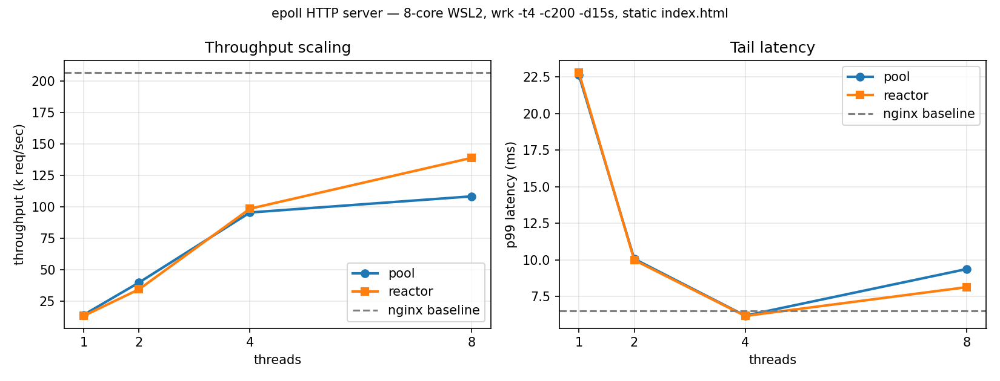

# Multi-threaded HTTP Server (C++)

[](https://github.com/ashwinruke/Multithreaded_Web_Server/actions/workflows/ci.yml)

An HTTP/1.1 server written from scratch in C++20 — no web frameworks, no HTTP
libraries. Non-blocking sockets, an `epoll` event loop in two interchangeable
concurrency models, an incremental request parser, keep-alive, routing, an LRU
file cache and an asynchronous logger.

## Build

Requires g++ 13+ (C++20), CMake 3.25+, Linux (`epoll` and `SO_REUSEPORT` are
Linux-specific; see *Portability* below).

```bash
cmake -B build -DCMAKE_BUILD_TYPE=Release
cmake --build build -j
```

## Run

```bash
./build/multithreaded-server                              # settings from .env
./build/multithreaded-server --mode reactor --threads 8   # CLI override
```

`.env` at the repo root holds `SERVER_IP`, `SERVER_PORT`, `MAX_THREADS`,
`CACHE_CAPACITY`, `IDLE_TIMEOUT` and `LOOP_MODE`. Flags `--mode`, `--threads`,
`--port` and `--ip` override it, which is what the benchmark sweep uses.

```bash
curl -i  http://127.0.0.1:8080/              # live dashboard
curl -s  http://127.0.0.1:8080/api/stats     # server metrics as JSON
curl -s  http://127.0.0.1:8080/demo/         # static demo page
```

Ctrl-C stops the loop, closes live connections and joins every thread.

## Two concurrency models

Both are compiled in and selected at startup, so they can be measured against
each other on identical code paths — the parser, router and handlers are shared;
only the loop differs.

**`--mode pool`** — one `epoll` thread owns `accept()` and readiness
notification; a fixed worker pool does the reads, parsing, handler work and
writes. Connections are registered with `EPOLLONESHOT`, so a descriptor is
disarmed the moment it fires and exactly one worker can own it until that worker
rearms it. That removes the usual thundering-herd and double-ownership problems,
at the cost of a queue hop and a shared connection table behind a mutex.

**`--mode reactor`** — N independent reactors. Each thread opens its own
listening socket on the same port with `SO_REUSEPORT` and runs its own `epoll`
instance and its own connection table. The kernel balances new connections
across the listeners, so there is no shared queue, no mutex on the data path and
better cache locality; the tradeoff is that load balancing is the kernel's
hashing rather than true work stealing, so one slow handler can hold up its own
reactor.

```
pool                                  reactor
────                                  ───────
epoll thread ── accept                thread 0: epoll + listener ── conns
     │                                thread 1: epoll + listener ── conns
     └─ queue ──► worker 0            thread 2: epoll + listener ── conns
                  worker 1            thread 3: epoll + listener ── conns
                  worker N                   (SO_REUSEPORT, no shared state)
```

## Live dashboard and API

`/` serves a dashboard that reads the running server's own metrics once per
second and plots throughput over the last minute: requests/sec, open
connections, handler percentiles, cache hit rate and status-code mix. Point a
benchmark at the server and the page moves in real time.

| Route          | Method | Purpose                                      |
|----------------|--------|----------------------------------------------|
| `/`            | GET    | Dashboard                                    |
| `/api/stats`   | GET    | Metrics snapshot as JSON                     |
| `/api/kv`      | GET    | List entries, or one entry with `?key=`      |
| `/api/kv`      | POST   | Store a value (JSON or form-encoded body)    |
| `/api/kv`      | DELETE | Remove an entry by `?key=`                   |
| `/healthz`     | GET    | Liveness probe                               |
| `/demo/`       | GET    | Original static demo page                    |

```bash
curl -X POST -H 'Content-Type: application/json' \
     -d '{"key":"hello","value":"world"}' http://127.0.0.1:8080/api/kv
curl "http://127.0.0.1:8080/api/kv?key=hello"
```

**Metrics are lock-free on the hot path.** Counters are plain atomics and
latencies go into a fixed 15-bucket histogram, so recording a request is a
handful of atomic adds with no allocation and constant memory regardless of
traffic. Percentiles are computed at read time from bucket boundaries, which
makes them approximate — the deliberate trade for never touching a lock while
serving.

**The key/value store is bounded.** Entry count, key length and value length are
all capped (50 / 64 / 256) and it returns 507 when full, because the endpoint is
public on the deployed instance. It is guarded by a single mutex: shared mutable
state across every worker thread, which is what makes it a real test of the
concurrency model rather than a toy echo route.

## Design notes

**Non-blocking I/O with an incremental parser.** A read can return half a
request line, or three pipelined requests at once. Each connection owns its
buffers and parser state across `epoll` wakeups; the parser consumes whatever is
complete and reports `NeedMore` otherwise. Nothing assumes one `recv()` equals
one request — the assumption that breaks most toy servers under real load.

**Keep-alive.** HTTP/1.1 connections persist by default and are reused until the
client sends `Connection: close`, a protocol error makes the stream
untrustworthy, or the idle sweep reclaims them after `IDLE_TIMEOUT` seconds.

**Partial writes.** `send()` can accept fewer bytes than offered. The unsent
remainder stays in the connection's write buffer and the descriptor switches to
`EPOLLOUT` until it drains, so large responses are never truncated.

**Path traversal is rejected by canonicalization.** Targets are resolved with
`weakly_canonical` and must remain inside the static root: `/../../etc/passwd`
returns 403, while a missing file inside the root returns 404. The two are kept
distinct deliberately.

**Bounded inputs.** Request line, header block and body each have hard limits
(8 KB / 16 KB / 1 MB), returning 414, 431 and 413. Without them, a single client
can drive the server out of memory.

**The logger never blocks a request path.** Callers push a formatted line onto a
queue; one writer thread owns the file handle, so disk latency stays off the hot
path.

**The LRU cache uses `std::list` + `unordered_map`.** Splicing to the front is
O(1) and invalidates no iterators, so the map stores iterators directly and
eviction from the back is O(1).

## Tests

```bash
ctest --test-dir build --output-on-failure   # 82 unit tests
./tests/smoke_test.sh                        # 38 end-to-end checks, both modes
```

Unit tests cover the parser, router, LRU cache, JSON/form decoding, the key
value store, static file handling and metrics; the smoke test drives a real
server over a socket, including pipelining, fragmented requests, keep-alive
reuse and SIGTERM shutdown. Every push runs both, plus the full suite under
AddressSanitizer, UndefinedBehaviorSanitizer and ThreadSanitizer. See
[`tests/README.md`](tests/README.md).

## Benchmarks

```bash
./bench/run_bench.sh 15s 200     # duration, connections
```

Sweeps both modes at 1/2/4/8 threads plus an nginx baseline on the same file,
and writes [`bench/results.md`](bench/results.md).

**Environment.** 8-core WSL2 (Linux 6.18, Ubuntu), `wrk -t4 -c200 -d15s`,
keep-alive, serving a 585-byte static file. The load generator shares the host
with the server, so absolute numbers run lower than a two-machine setup would
produce; the comparison between configurations is the point.



| Configuration       | req/sec     | p50      | p90      | p99      |
|---------------------|-------------|----------|----------|----------|
| pool, 1 worker      |   13,890    | 14.29ms  | 17.28ms  | 22.65ms  |
| pool, 2 workers     |   39,667    |  4.71ms  |  6.71ms  | 10.06ms  |
| pool, 4 workers     |   95,422    |  1.72ms  |  3.62ms  |  6.18ms  |
| pool, 8 workers     |  108,293    |  1.40ms  |  3.36ms  |  9.37ms  |
| reactor, 1 thread   |   13,000    | 14.98ms  | 17.70ms  | 22.81ms  |
| reactor, 2 threads  |   34,274    |  5.68ms  |  7.13ms  |  9.98ms  |
| reactor, 4 threads  |   98,449    |  1.75ms  |  3.67ms  |  6.16ms  |
| **reactor, 8 threads** | **138,972** | **1.02ms** | 3.92ms | 8.13ms |
| nginx (baseline)    |  207,059    |  0.47ms  |  2.92ms  |  6.49ms  |

**Sustained load.** A separate 60-second run at 1,400 concurrent keep-alive
connections (`wrk -t8 -c1400 -d60s`, reactor mode, 8 threads) served 7,547,408
requests at 125,594 req/sec and 11.20ms average latency, transferring 4.74 GB
with no socket errors and no connection leaks — active connections returned to
zero after the idle sweep. Holding 1,400 connections open matters more than
peak throughput: it is the property that separates an event loop from a
thread-per-connection design.

### What the numbers show

**The reactor model wins once contention appears, not before.** At 1–4 threads
the two models are within noise, and the pool is marginally ahead at 2. At 8
threads the reactor is 28% faster (138,972 vs 108,293 req/sec) with a lower p50.
The cause is structural: the pool routes every ready connection through one
shared work queue behind a mutex, and at ~100k req/sec that queue is contended
on every request. Each reactor instead owns its own `epoll` instance and
connection table, with `SO_REUSEPORT` letting the kernel distribute new
connections, so there is no shared mutable state on the data path.

**Scaling is near-linear to 4 threads, then flattens.** The pool's 4→8 step
returns only 13% more throughput while the reactor's returns 41% — on identical
hardware, running identical handler code. That contrast is the evidence that the
pool's ceiling is contention rather than CPU.

**Tail latency is not monotonic with throughput.** Both models post their best
p99 at 4 threads (6.18ms and 6.16ms) and get worse at 8 despite serving more
requests — the pool notably so, at 9.37ms. More threads than cores means
preemption mid-request, and for the pool it also means longer queue waits. If
p99 mattered more than raw throughput, 4 threads would be the right setting for
this machine.

**nginx is ~1.5× faster, and the gap is instructive.** nginx serves this file
with `sendfile()`, copying from page cache straight to the socket inside the
kernel. This server reads the file into its LRU cache, copies the content into a
response buffer, then writes it — two userspace copies nginx never makes.
Closing most of that gap means `sendfile()` for static responses plus a
scatter-gather `writev()` for header and body, which is a deliberate next step
rather than a tuning knob.

### Configuration guidance

`--mode reactor --threads $(nproc)` for throughput. `--mode pool --threads 4`
when bounded tail latency matters more: the pool's fixed worker count caps how
many handlers run at once, while the reactor will happily occupy every thread
with a slow handler.

## Portability

Linux only. `epoll` has no portable equivalent; `kqueue` (BSD/macOS) or IOCP
(Windows) would need a second `EventLoop` implementation. The interface is
already the seam where that would go.

## Roadmap

- [x] Non-blocking `epoll` core, both concurrency models
- [x] Incremental parser, keep-alive, pipelining, idle timeouts
- [x] Routing table with 405/Allow handling
- [x] Live metrics dashboard at `/` and `/api/stats`
- [x] In-memory JSON API endpoints
- [x] Unit tests (GoogleTest) and GitHub Actions CI
- [x] Published benchmark results vs nginx
- [ ] `sendfile()` for static responses